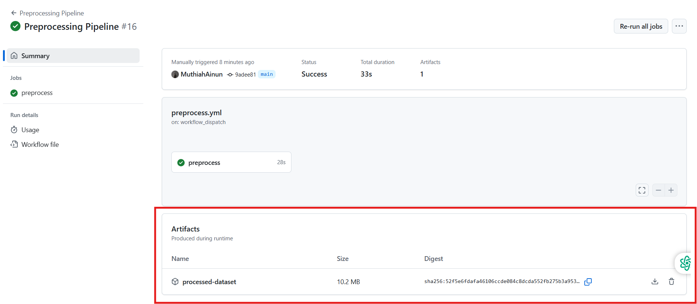
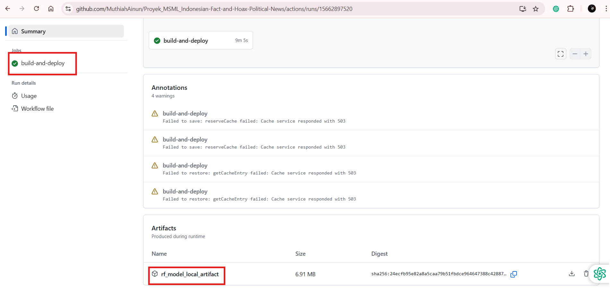
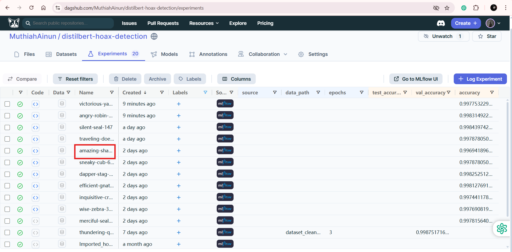
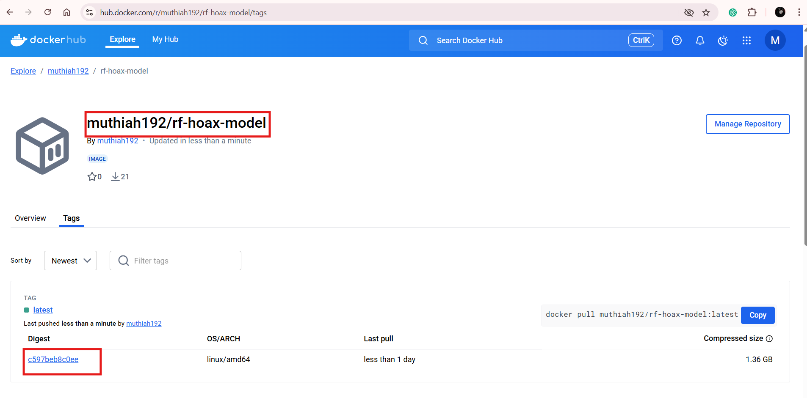
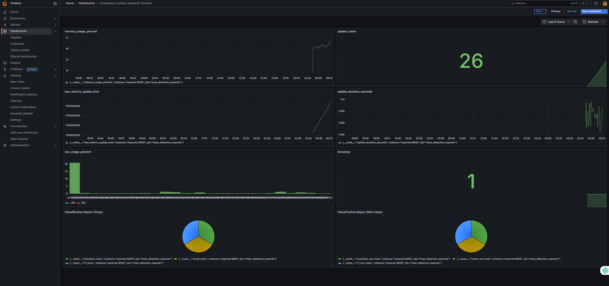
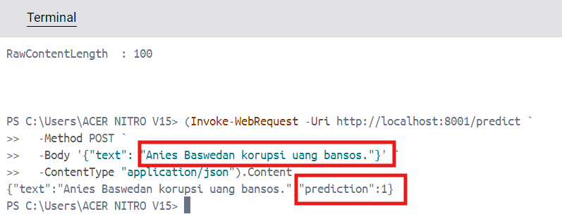
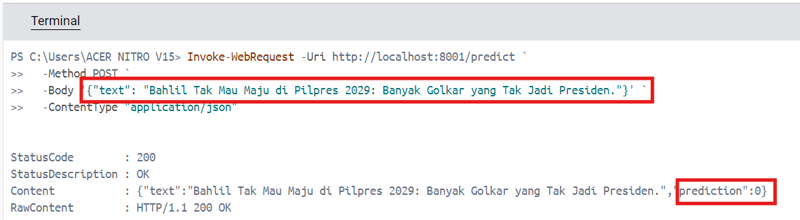

# Proyek_MSML_Indonesian-Fact-and-Hoax-Political-News

## 🗂️ Dataset Description: **Indonesian Fact and Hoax Political News**

This dataset is a collection of Indonesian political news articles categorized into two main classes: Non-Hoax/Fact (valid) and Hoax (disinformation). It is sourced from both credible and non-credible platforms and is intended for training text classification models to detect fake news.

**📁 Dataset Files**

The dataset consists of the following files and their respective sources:

- `dataset_tempo_6k_cleaned.xlsx` – Valid political news from Tempo (~6,000 entries)

- `dataset_kompas_4k_cleaned.xlsx` – Valid political news from Kompas (~4,000 entries)

- `dataset_cnn_10k_cleaned.xlsx` – Valid political news from CNN Indonesia (~10,000 entries)

- `dataset_turnbackhoax_10_cleaned.xlsx` – Hoax news from Turnbackhoax.id (~10,000 entries)

**✅ Truth Labels**

1. **Valid / Factual:** Collected from mainstream and trusted news portals: CNN Indonesia, Tempo, and Kompas.

2. **Hoax / Disinformation:** Collected from Turnbackhoax.id, a site that aggregates and verifies false or misleading claims.

**🔍 Dataset Source**

This dataset was downloaded from Kaggle:  
[Indonesian Fact and Hoax Political News](https://www.kaggle.com/datasets/linkgish/indonesian-fact-and-hoax-political-news?resource=download)

---
## ⚙️ Project Workflow Overview (GitHub Actions)

This project is designed to be built and executed using **GitHub Actions workflows**. 

### Step 1️⃣ : Running the Preprocessing Pipeline Workflow (`preprocess.yml`)
The first step in the process is **preprocessing the four datasets**. Simply trigger the workflow defined in the `preprocess.yml` file located in `.github/workflows/`.

Once the workflow runs successfully, the **preprocessed dataset will be saved as an artifact**, which can be downloaded directly from the [GitHub Actions interface](https://github.com/MuthiahAinun/Proyek_MSML_Indonesian-Fact-and-Hoax-Political-News/actions/runs/15024307645).  
📎 Artifact Example:  


---

### 📁 Project Folder Structure

```
Proyek_MSML_Indonesian-Fact-and-Hoax-Political-News
├── .github/workflows
│ └── preprocess.yml # Workflow file for dataset preprocessing
├── Experiment
│ ├── dataset_raw # Folder containing original raw datasets
│ │ └── dataset_cnn_10k_cleaned.xlsx
│ │ └── dataset_kompas_4k_cleaned.xlsx
│ │ └── dataset_tempo_6k_cleaned.xlsx
│ │ └── dataset_turnbackhoax_10k_cleaned.xlsx
│ ├── preprocessing # Folder for all preprocessing outputs
│ │ └── Artifak-Preprocessing.png # Image preview of preprocessing artifact
│ │ └── Eksperimen_MSML_Tsamarah_Muthiah_Abdullah.ipynb # Full notebook for preprocessing, training, and inference (Colab-based)
│ │ └── automate_Tsamarah-Muthiah-Abdullah.py # Python script to automate preprocessing (used in preprocess.yml)
│ │ └── dataset-cleaned.gz # Cleaned dataset exported from Colab
│ │ └── dataset_cleaned_prepo.gz # Cleaned dataset generated automatically from Pipeline workflow artifact
```

---

> This setup ensures reproducibility and automation of the preprocessing phase, making it easier to integrate into continuous workflows and model training pipelines.

---
### 🚀 Step 2️⃣: Model Training via GitHub Actions CI with MLflow Logging & Docker Build Automation

In this stage, the complete training and deployment pipeline is executed automatically through **GitHub Actions CI**. The model is trained using **MLflow Projects** and all training artifacts (including metrics, plots, and the model itself) are logged to **DagsHub MLflow Tracking**. Once training is complete, a **Docker image** is built and pushed to **Docker Hub** for deployment purposes.


---

### 🧠 Model Training via GitHub Actions using MLflow

The model is trained entirely through a CI workflow on GitHub, using the `mlflow run` command inside the GitHub Actions pipeline.

📄 GitHub Workflow File: `.github/workflows/ci.yaml`
This workflow automatically performs:

1. Sets up an isolated environment using `micromamba`
2. Triggers the **MLflow Project** (MLProject) via `mlflow run`
3. Executes the `modelling.py` script which:
- Applies Easy **Data Augmentation (EDA)** to the text
- Preprocesses and tokenizes data
- Trains a `RandomForestClassifier` pipeline with TF-IDF
- Logs metrics (accuracy, precision, recall, f1-score) and plots (confusion matrix) to MLflow
- Saves the model locally and logs it as an MLflow artifact

📦 Artifact output and full logs are available here:
[GitHub Actions Artifact](https://github.com/MuthiahAinun/Proyek_MSML_Indonesian-Fact-and-Hoax-Political-News/actions/runs/15662897520)

Artifact output and full logs are available here:
🔗 


📊 Example of MLflow tracking UI after CI execution:
🔗 [MLflow UI]([Model/Screenshoot-Artifact-MLFLow-CI.png](https://dagshub.com/MuthiahAinun/distilbert-hoax-detection.mlflow/#/experiments/0/runs/6283d6e3994e4010960dc29b50414ace)


---
### 🐳 Docker Image Build via GitHub Actions `(mlflow models build-docker)`

After the model is saved, GitHub CI proceeds to build a **Docker image** using `mlflow models build-docker`, which packages the trained model with a RESTful inference server.

The image is then pushed to Docker Hub:
- ✅ Automatically tagged as latest
- ✅ Built from the saved model at Model/rf_model_local

🔗 [Docker Hub - RF Hoax Mode](https://hub.docker.com/r/muthiah192/rf-hoax-model/tags)



---
### 📁 Folder Structure for Step 2
```
├── .github/workflows
│   └── ci.yaml                      # GitHub CI workflow for training & Docker build
├── Model
│   ├── MLProject                    # MLflow project configuration file
│   ├── conda.yaml                   # Conda environment specification for training
│   ├── modelling.py                 # Training script with EDA, model, and logging
│   ├── dataset_cleaned_prepo.gz    # Preprocessed dataset
│   ├── URL_Docker_Image            # File containing Docker image link
│   ├── Screenshoot-Artifact-Github.png
│   ├── Screenshoot-Artifact-MLFLow-CI.png
│   ├── Screenshot-Tampilan-Image-Docker.png
│   └── Screenshoot-tampilan-dagshub.png
```
---
### 📊 Validation Metrics
| **Metric** | **Score** |
| ---------- | --------- |
| Accuracy   | 0.999     |
| Precision  | 0.999     |
| Recall     | 0.999     |
| F1-score   | 0.999     |


```
              precision    recall  f1-score   support

           0       1.00      1.00      1.00     12518
           1       1.00      0.99      0.99      3505

    accuracy                           1.00     16023
   macro avg       1.00      0.99      1.00     16023
weighted avg       1.00      1.00      1.00     16023

```

---
## 📂 MLflow & DagsHub Artifact View

All MLflow tracking outputs (model, metrics, plots) have been logged and published to DagsHub, integrated with version control.


The **MLflow tracking artifacts** for this project have been successfully uploaded and integrated with **DagsHub**, and can be accessed at the following link:

🔗 [View MLflow Experiments on DagsHub](https://dagshub.com/MuthiahAinun/distilbert-hoax-detection.mlflow/#/experiments/0/runs/6283d6e3994e4010960dc29b50414ace/artifacts)

  
---
> ✅ This CI-driven automation ensures consistent training, tracking, and deployable packaging — making the model ready for serving, inference, and further monitoring in production environments.
---

## Step 3️⃣: Building a Monitoring Dashboard Using Prometheus and Grafana (Locally)

In this step, we set up **monitoring and alerting** using **Prometheus and Grafana** on a local machine. This monitoring system helps us track the performance and behavior of the deployed model in real-time.

---

### 🐳 Step-by-Step Setup

1. **Install Docker Desktop**
   - Download and install Docker Desktop for your OS from the [official website](https://www.docker.com/products/docker-desktop/).

2. **Run Docker Compose**
   - Open a terminal and navigate to the project root directory.
   - Execute the following command:
     ```bash
     docker-compose up -d
     ```
   - This command will start four services:
     - **Exporter**: Serves model metrics using the Docker image from the previous step.
     - **Inference**: Runs inference using all files in the `inference_service` folder.
     - **Prometheus**: Collects metrics defined in `prometheus_exporter.py`.
     - **Grafana**: Provides a UI for monitoring and setting alerts.

---

### 🔧 `docker-compose.yml` Explanation

```
exporter:
  build:
    context: ./Monitoring
  ports:
    - "8000:8000"
  restart: always
  volumes:
    - ./Monitoring/classification_metrics.json:/app/classification_metrics.json
```
**Exporter:** This container runs a Python script that reads the `classification_metrics.json` file containing model evaluation results (e.g., precision, recall, f1-score, accuracy).
Additionally, it monitors CPU usage, memory usage, and update timings. All metrics are exposed on port `8000` for Prometheus to scrape.


---
```
inference:
  image: muthiah192/rf-hoax-model:latest
  ports:
    - "8001:8001"
  restart: always
  volumes:
    - ./inference_service/rf_model:/app/rf_model
```
**Inference_service:** Handles real-time hoax prediction requests using a pre-trained Random Forest model stored in the rf_model directory (trained and logged using MLflow).
This service is built with FastAPI and exposes a /predict endpoint on port 8001.
It also runs a Prometheus client inside the container to expose metrics such as request count, predicted labels, and request latency.


---
```
prometheus:
  image: prom/prometheus:latest
  volumes:
    - ./Monitoring/prometheus.yml:/etc/prometheus/prometheus.yml
  ports:
    - "9090:9090"
  restart: always
```
**Prometheus:** Configured to scrape metrics from both the inference and exporter services using `prometheus.yml`.The Prometheus dashboard is available at port `9090`.

---
```
grafana:
  image: grafana/grafana:latest
  ports:
    - "3000:3000"
  volumes:
    - grafana-storage:/var/lib/grafana
  restart: always
  environment:
    - GF_SECURITY_ADMIN_PASSWORD=admin
    - GF_SMTP_ENABLED=true
    - GF_SMTP_HOST=smtp.gmail.com:587
    - GF_SMTP_USER=amirahannazihah@gmail.com
    - GF_SMTP_PASSWORD=APP_PASS
    - GF_SMTP_FROM_ADDRESS=amirahannazihah@gmail.com
    - GF_SMTP_SKIP_VERIFY=true
```
**Grafana:** Used to visualize metrics collected by Prometheus. Alerts can be configured and sent via email when specific thresholds are breached. Grafana's dashboard is accessible on port `3000`.

---
## 📈 Monitored Metrics

### 🔍 From `prometheus_exporter.py` (Model Evaluation & System Monitoring)

The following Prometheus metrics are defined in `prometheus_exporter.py`:
```
# Classification metrics
precision_non_hoax       # Precision for non-hoax class
recall_non_hoax          # Recall for non-hoax class
f1_non_hoax              # F1-score for non-hoax class

precision_hoax           # Precision for hoax class
recall_hoax              # Recall for hoax class
f1_hoax                  # F1-score for hoax class

accuracy                 # Overall model accuracy

# System metrics
cpu_usage_percent        # Current CPU usage (%)
memory_usage_percent     # Current memory usage (%)

# Additional metrics
last_metrics_update_time # Timestamp of the last metric update
update_count             # Number of times the metrics have been updated
update_duration_seconds  # Time taken to update the metrics
```
### 🚀 From `inference.py` (Real-time Inference Monitoring)

```
inference_requests_total            # Total number of prediction requests
predicted_label_count{label}       # Count of predicted labels (hoax / non-hoax)
inference_request_latency_seconds  # Latency per request in seconds

```

### 📦 Volume Configuration
Persists Grafana’s dashboards and configuration even if the container is restarted.
```
volumes:
  grafana-storage:
```
---
## 📊 Grafana Dashboard & Alerts


**Sample dashboard:**


**Alerting Example:**

An alert rule is triggered if accuracy drops below 2%, and Grafana sends a notification to the configured email.


---
## 🧪 Inference Testing

You can perform inference directly from the running Docker container.

Example hoax inference result:



Example non-hoax inference result:



---
## 📁 Folder Structure for Monitoring and Inference
```
├── docker-compose.yml          # Used to launch exporter, inference, prometheus, and grafana
├── Monitoring
│   └── Alerting Grafana        # Screenshots of alert rules and notifications
│   └── Monitoring Grafana      # Grafana metrics dashboard screenshots
│   └── Monitoring Prometheus   # Prometheus metrics dashboard screenshots
│   └── prometheus.yml          # Prometheus configuration file
│   └── prometheus_exporter.py  # Script exposing model metrics for Prometheus
│   └── classification_metrics.json
├── Inference_serving
│   └── Dockerfile              # Dockerfile to serve inference API
│   └── inference.py            # FastAPI app to handle /predict and /metrics
│   └── rf_model            
```
---
