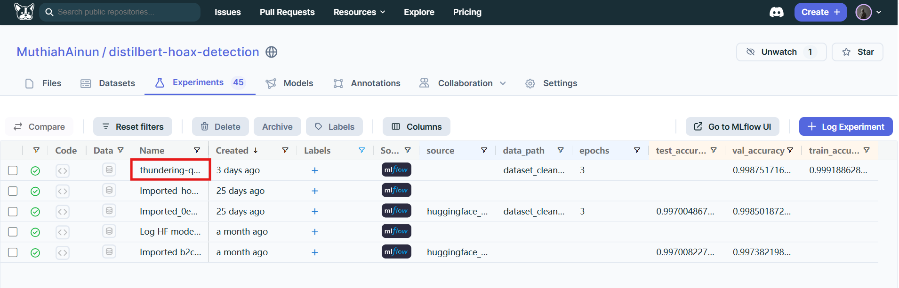
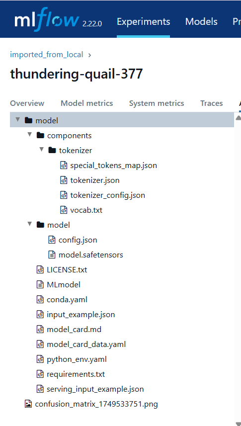
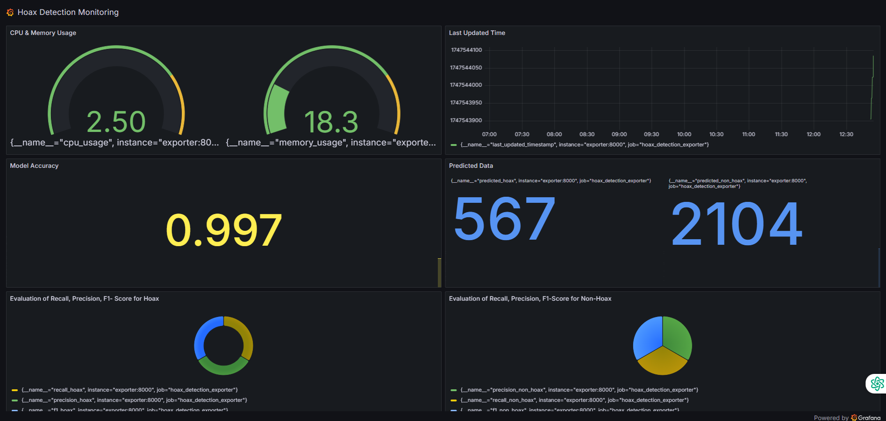

# Proyek_MSML_Indonesian-Fact-and-Hoax-Political-News

## 🗂️ Dataset Description: **Indonesian Fact and Hoax Political News**

This dataset is a collection of Indonesian political news articles categorized into two main classes: Non-Hoax/Fact (valid) and Hoax (disinformation). It is sourced from both credible and non-credible platforms and is intended for training text classification models to detect fake news.

**📁 Dataset Files**

The dataset consists of the following files and their respective sources:

- `dataset_tempo_6k_cleaned.xlsx` – Valid political news from Tempo (~6,000 entries)

- `dataset_kompas_4k_cleaned.xlsx` – Valid political news from Kompas (~4,000 entries)

- `dataset_cnn_10k_cleaned.xlsx` – Valid political news from CNN Indonesia (~10,000 entries)

- `dataset_turnbackhoax_10_cleaned.xlsx` – Hoax news from Turnbackhoax.id (~10,000 entries)

**✅ Truth Labels**

1. **Valid / Factual:** Collected from mainstream and trusted news portals: CNN Indonesia, Tempo, and Kompas.

2. **Hoax / Disinformation:** Collected from Turnbackhoax.id, a site that aggregates and verifies false or misleading claims.

**🔍 Dataset Source**

This dataset was downloaded from Kaggle:  
[Indonesian Fact and Hoax Political News](https://www.kaggle.com/datasets/linkgish/indonesian-fact-and-hoax-political-news?resource=download)

---
## ⚙️ Project Workflow Overview (GitHub Actions)

This project is designed to be built and executed using **GitHub Actions workflows**. 

### Step 1️⃣ : Running the Preprocessing Pipeline Workflow (`preprocess.yml`)
The first step in the process is **preprocessing the four datasets**. Simply trigger the workflow defined in the `preprocess.yml` file located in `.github/workflows/`.

Once the workflow runs successfully, the **preprocessed dataset will be saved as an artifact**, which can be downloaded directly from the [GitHub Actions interface](https://github.com/MuthiahAinun/Proyek_MSML_Indonesian-Fact-and-Hoax-Political-News/actions/runs/15024307645).  
📎 Artifact Example:  


---

### 📁 Project Folder Structure

```
Proyek_MSML_Indonesian-Fact-and-Hoax-Political-News
├── .github/workflows
│ └── preprocess.yml # Workflow file for dataset preprocessing
├── Experiment
│ ├── dataset_raw # Folder containing original raw datasets
│ │ └── dataset_cnn_10k_cleaned.xlsx
│ │ └── dataset_kompas_4k_cleaned.xlsx
│ │ └── dataset_tempo_6k_cleaned.xlsx
│ │ └── dataset_turnbackhoax_10k_cleaned.xlsx
│ ├── preprocessing # Folder for all preprocessing outputs
│ │ └── Artifak-Preprocessing.png # Image preview of preprocessing artifact
│ │ └── Eksperimen_MSML_Tsamarah_Muthiah_Abdullah.ipynb # Full notebook for preprocessing, training, and inference (Colab-based)
│ │ └── automate_Tsamarah-Muthiah-Abdullah.py # Python script to automate preprocessing (used in preprocess.yml)
│ │ └── dataset-cleaned.gz # Cleaned dataset exported from Colab
│ │ └── dataset_cleaned_prepo.gz # Cleaned dataset generated automatically from Pipeline workflow artifact
```

---

> This setup ensures reproducibility and automation of the preprocessing phase, making it easier to integrate into continuous workflows and model training pipelines.

---
### 🚀 Step 2️⃣ : Model Training on Colab using MLflow & Docker Build via GitHub CI

In this stage, the complete model training and logging process is carried out in **Google Colab** using a **GPU** environment through **MLflow**, while the **Docker image** is automatically built using **GitHub Actions CI** to support efficient deployment automation.

---

### 🧠 Model Training via Google Colab (GPU) using MLflow

The model is trained locally in **Google Colab** by running the following MLflow command:

```bash
!mlflow run . \
  --env-manager=local \
  -P dagshub_token=$DAGSHUB_TOKEN \
  -P hf_token=$HF_TOKEN \
  -P mlflow_uri=$MLFLOW_TRACKING_URI \
  -P mlflow_user=$MLFLOW_TRACKING_USERNAME \
  -P mlflow_pass=$MLFLOW_TRACKING_PASSWORD \
  -P github_repo=$GITHUB_REPO \
  -P github_token=$GITHUB_TOKEN \
  -P hf_repo_id=$HF_REPO_ID
```

📌 This command triggers the **MLflow Project** (`MLproject`) which performs the following steps:

- Preprocessing and **text augmentation** using Easy Data Augmentation (EDA)
- Text **tokenization**, dataset creation, and DataLoader setup
- Fine-tuning the `distilbert-base-indonesian` model from Hugging Face for hoax classification
- Logging model parameters, metrics, and artifacts to **MLflow Tracking Server** and **DagsHub**
- Saving and uploading the trained model to **Hugging Face Hub**

🔗 [Hugging Face Model - distilbert-hoax-classifier](https://huggingface.co/Muthiah192/fact-hoax-classifications/tree/main)

---
### 🛠️ Docker Image Build via GitHub Actions (`docker-build.yaml`)

Once the model has been successfully trained and uploaded to Hugging Face, the next step is to **build a Docker image** using GitHub Actions CI. The docker-build.yaml workflow:

- Pulls the trained model from the mlflow_model/model directory
- Builds a **Docker image** using MLflow's built-in serving tools
- Pushes the resulting Docker image to **Docker Hub**

🔗 [Docker Image - Fact Hoax Classifier](https://hub.docker.com/r/muthiah192/fact-hoax-classifier/tags)

---
### 📁 Folder Structure for Step 2
```
├── Model
│   ├── Screenshoot-Artifact-Dagshub.png       # Visualization of artifacts on DagsHub
│   ├── Screenshoot-Artifact-ModelCI.png       # Screenshot of CI workflow run
│   ├── Mutiah_abdullah-Dashboard-Grafana.png  # Grafana monitoring dashboard preview
│   ├── MLProject                               # MLflow project configuration file
│   ├── URL_Docker_Image                        # File containing the Docker image link
│   ├── URL_Model_Saved                         # File containing the Hugging Face model link
│   ├── modelling.py                            # Handles tokenization, dataset splitting, and model architecture
│   ├── train_and_log.py                        # Script for model training and MLflow logging
│   └── dataset_cleaned_prepo.gz                # Cleaned dataset after preprocessing
│   └── .env                                    # Environment variable file used during training on Colab via MLflow
```
---
### 📊 Validation Metrics
| **Metric** | **Score** |
| ---------- | --------- |
| Accuracy   | 0.9988    |
| Precision  | 0.9988    |
| Recall     | 0.9988    |
| F1-score   | 0.9988    |

```
              precision    recall  f1-score   support

           0       1.00      1.00      1.00      6293
           1       1.00      1.00      1.00      1718

    accuracy                           1.00      8011
   macro avg       1.00      1.00      1.00      8011
weighted avg       1.00      1.00      1.00      8011
```

---
## 🎗️ MLflow Artifacts - Fact Hoax Detection on DagsHub:

The **MLflow tracking artifacts** for this project have been successfully uploaded and integrated with **DagsHub**, and can be accessed at the following link:

🔗 [View MLflow Experiments on DagsHub](https://dagshub.com/MuthiahAinun/distilbert-hoax-detection.mlflow/#/experiments/0/runs/b0444424210e48c9a4f1c98188861c9d/artifacts)




Once the workflow runs successfully, the preprocessed dataset will be saved as an **artifact**.
📎 

  
---
> This step is critical for ensuring model performance and deploying the result into a containerized environment for inference or monitoring purposes.
---

## Step 3️⃣: Building a Monitoring Dashboard Using Prometheus and Grafana (Locally)

In this step, we set up **monitoring and alerting** using **Prometheus and Grafana** on a local machine. This monitoring system helps us track the performance and behavior of the deployed model in real-time.

---

### 🐳 Step-by-Step Setup

1. **Install Docker Desktop**
   - Download and install Docker Desktop for your OS from the [official website](https://www.docker.com/products/docker-desktop/).

2. **Run Docker Compose**
   - Open a terminal and navigate to the project root directory.
   - Execute the following command:
     ```bash
     docker-compose up -d
     ```
   - This command will start four services:
     - **Exporter**: Serves model metrics using the Docker image from the previous step.
     - **Inference**: Runs inference using all files in the `inference_service` folder.
     - **Prometheus**: Collects metrics defined in `prometheus_exporter.py`.
     - **Grafana**: Provides a UI for monitoring and setting alerts.

---

### 🔧 `docker-compose.yml` Explanation

```
exporter:
    build:
      context: ./Monitoring
    ports:
      - "8000:8000"
    restart: always
```
**Exporter:** Exposes Prometheus-compatible metrics by running a Python exporter script, using evaluation results from the MLflow-built model. It exposes metrics like accuracy, precision, and system resource usage on port 8000.

---
```
inference:
    build:
      context: ./inference_service
    ports:
      - "8001:8001"
    restart: always
```
**Inference:** Builds a Docker image from the inference_service directory and serves real-time inference on port 8001 using the DistilBERT model loaded from Hugging Face.

---
```
prometheus:
    image: prom/prometheus:latest
    volumes:
      - ./prometheus.yml:/etc/prometheus/prometheus.yml
    ports:
      - "9090:9090"
    restart: always
```
**Prometheus:** Collects metrics by scraping from the exporter. It reads its configuration from the prometheus.yml file and serves its dashboard on port 9090.

---
```
grafana:
  image: grafana/grafana:latest
  ports:
    - "3000:3000"
  restart: always
  volumes:
    - grafana-storage:/var/lib/grafana
  environment:
    - GF_SECURITY_ADMIN_PASSWORD=admin
    - GF_SMTP_ENABLED=true
    - GF_SMTP_HOST=smtp.gmail.com:587
    - GF_SMTP_USER=amirahannazihah@gmail.com
    - GF_SMTP_PASSWORD=APP_PASSWORD
    - GF_SMTP_FROM_ADDRESS=amirahannazihah@gmail.com
    - GF_SMTP_SKIP_VERIFY=true
```
**Grafana:** Visualizes data from Prometheus and sends alert notifications to email when thresholds are breached.

---
## 📈 Monitored Metrics

The following Prometheus metrics are defined in prometheus_exporter.py:
```
precision_non_hoax = Gauge('precision_non_hoax', 'Precision for non-hoax class')
recall_non_hoax = Gauge('recall_non_hoax', 'Recall for non-hoax class')
f1_non_hoax = Gauge('f1_non_hoax', 'F1-score for non-hoax class')

precision_hoax = Gauge('precision_hoax', 'Precision for hoax class')
recall_hoax = Gauge('recall_hoax', 'Recall for hoax class')
f1_hoax = Gauge('f1_hoax', 'F1-score for hoax class')

accuracy = Gauge('accuracy', 'Overall accuracy')
cpu_usage = Gauge('cpu_usage', 'CPU usage (%)')
memory_usage = Gauge('memory_usage', 'Memory usage (%)')

pred_non_hoax = Gauge('predicted_non_hoax', 'Total predicted non-hoax')
pred_hoax = Gauge('predicted_hoax', 'Total predicted hoax')

last_updated = Gauge('last_updated_timestamp', 'Timestamp of last metrics update')
```
---
## 📊 Grafana Dashboard & Alerts

Grafana dashboards are created using data sourced from Prometheus.

**Sample dashboard:**


**Alerting Example:**

An alert rule is triggered if accuracy drops below 90%, and Grafana sends a notification to the configured email.


---
## 🧪 Inference Testing

You can perform inference directly from the running Docker container.

Example hoax inference result:


Example non-hoax inference result:


---
## 📁 Folder Structure for Monitoring and Inference
```
├── docker-compose.yml          # Used to launch exporter, inference, prometheus, and grafana
├── Monitoring
│   └── Alerting Grafana        # Screenshots of alert rules and notifications
│   └── Monitoring Grafana      # Grafana metrics dashboard screenshots
│   └── Monitoring Prometheus   # Prometheus metrics dashboard screenshots
│   └── prometheus.yml          # Prometheus configuration file (see below)
│   └── prometheus_exporter.py  # Script exposing model metrics for Prometheus (see below)
├── Inference_serving
│   └── Dockerfile              # Dockerfile to serve inference API (see below)
│   └── inference.py            # FastAPI app to handle /predict and /metrics (see below)
```
### 📄 File Descriptions

`prometheus.yml`: Configuration file specifying the Prometheus scrape targets, such as the exporter running on port 8000.

`prometheus_exporter.py`: Python script that serves performance metrics (accuracy, precision, recall, system stats) via HTTP using Prometheus’ client library.

`Dockerfile` (in Inference_serving): Defines how the inference server container is built. Includes Python packages and inference.py entry point.

`inference.py` : A FastAPI-based server that loads the model from Hugging Face, exposes a /predict endpoint for predictions, and /metrics endpoint for Prometheus.

---
