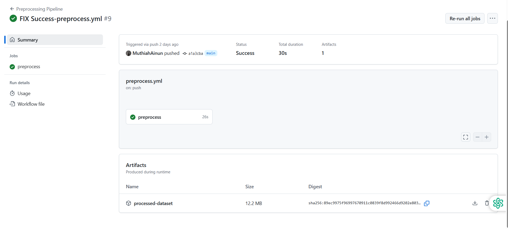
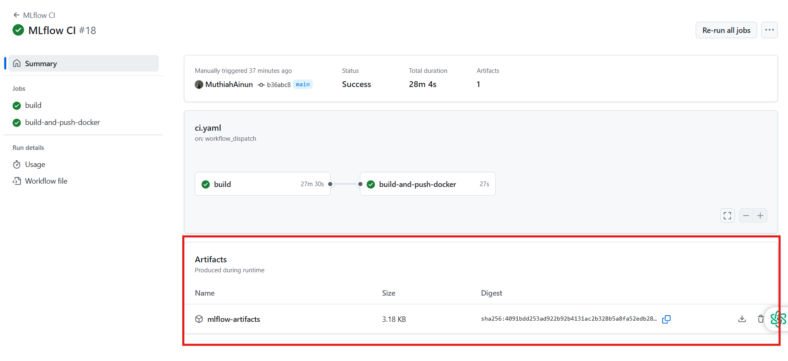
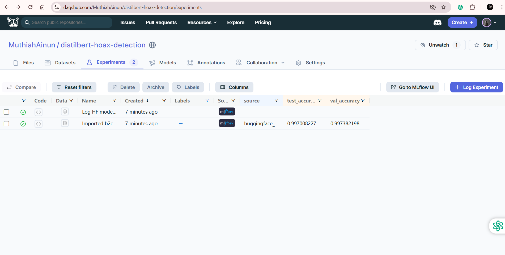

# Proyek_MSML_Indonesian-Fact-and-Hoax-Political-News

## 🗂️ Dataset Description: **Indonesian Fact and Hoax Political News**

This dataset is a collection of Indonesian political news articles categorized into two main classes: Non-Hoax/Fact (valid) and Hoax (disinformation). It is sourced from both credible and non-credible platforms and is intended for training text classification models to detect fake news.

**📁 Dataset Files**

The dataset consists of the following files and their respective sources:

- `dataset_tempo_6k_cleaned.xlsx` – Valid political news from Tempo (~6,000 entries)

- `dataset_kompas_4k_cleaned.xlsx` – Valid political news from Kompas (~4,000 entries)

- `dataset_cnn_10k_cleaned.xlsx` – Valid political news from CNN Indonesia (~10,000 entries)

- `dataset_turnbackhoax_10_cleaned.xlsx` – Hoax news from Turnbackhoax.id (~10,000 entries)

**✅ Truth Labels**

1. **Valid / Factual:** Collected from mainstream and trusted news portals: CNN Indonesia, Tempo, and Kompas.

2. **Hoax / Disinformation:** Collected from Turnbackhoax.id, a site that aggregates and verifies false or misleading claims.

**🔍 Dataset Source**

This dataset was downloaded from Kaggle:  
[Indonesian Fact and Hoax Political News](https://www.kaggle.com/datasets/linkgish/indonesian-fact-and-hoax-political-news?resource=download)

---
## ⚙️ Project Workflow Overview (GitHub Actions)

This project is designed to be built and executed using **GitHub Actions workflows**. 

### Step 1️⃣ : Running the Preprocessing Pipeline Workflow (`preprocess.yml`)
The first step in the process is **preprocessing the four datasets**. Simply trigger the workflow defined in the `preprocess.yml` file located in `.github/workflows/`.

Once the workflow runs successfully, the **preprocessed dataset will be saved as an artifact**, which can be downloaded directly from the GitHub Actions interface.  
📎 Artifact Example:  


---

### 📁 Project Folder Structure

```
Proyek_MSML_Indonesian-Fact-and-Hoax-Political-News
├── .github/workflows
│ └── preprocess.yml # Workflow file for dataset preprocessing
├── Experiment
│ ├── dataset_raw # Folder containing original raw datasets
│ │ └── dataset_cnn_10k_cleaned.xlsx
│ │ └── dataset_kompas_4k_cleaned.xlsx
│ │ └── dataset_tempo_6k_cleaned.xlsx
│ │ └── dataset_turnbackhoax_10k_cleaned.xlsx
│ ├── preprocessing # Folder for all preprocessing outputs
│ │ └── Artifak-Preprocessing.png # Image preview of preprocessing artifact
│ │ └── Eksperimen_MSML_Tsamarah_Muthiah_Abdullah.ipynb # Full notebook for preprocessing, training, and inference (Colab-based)
│ │ └── automate_Tsamarah-Muthiah-Abdullah.py # Python script to automate preprocessing (used in preprocess.yml)
│ │ └── dataset-cleaned.gz # Cleaned dataset exported from Colab
│ │ └── dataset_cleaned.gz # Cleaned dataset generated automatically from GitHub workflow artifact
```

---

> This setup ensures reproducibility and automation of the preprocessing phase, making it easier to integrate into continuous workflows and model training pipelines.

---
### Step 2️⃣ : Running the CI Workflow (`ci.yaml`)

The second step of this project involves running the **CI workflow file `ci.yaml`**, which automates the training and evaluation process. This workflow will trigger the execution of `train_and_log.py` and `modelling.py`. The key processes in this step include:

- Performing **oversampling using Easy Data Augmentation (EDA)** to address class imbalance (minority class: `hoax == 1`)
- Tokenizing the text data
- Setting up PyTorch DataLoaders
- Splitting the dataset into 80% training and 20% validation
- Loading a **pre-trained model** from Hugging Face:  
  🔗 [Hugging Face Model - distilbert-hoax-classifier](https://huggingface.co/Muthiah192/distilbert-hoax-classifier/tree/main)
- Evaluating the model on the dataset
- Uploading MLflow artifacts
- Building and pushing a Docker image to Docker Hub:  
  🔗 [Docker Image - Hoax Exporter](https://hub.docker.com/r/muthiah192/hoax-exporter)

📎 Artifact Example:  


---

### 📁 Folder Structure for Step 2
```
├── .github/workflows Artifak-MLFlow-Dagshub.png
│ └── ci.yaml # CI workflow file for model training and Docker image build
├── Model
│ └── Artifak-MLFlow-Dagshub.png # Visual artifact Dagshub
│ └── Artifak-Model.png # Visual artifact from CI workflow run
│ └── Dashboard-Monitoring-Grafana-12-metrics.png # Grafana monitoring dashboard preview
│ └── MLProject # MLflow project file to enable automated retraining
│ └── URL_Docker_Image # File containing link to the generated Docker image
│ └── URL_Model_Saved # File containing link to the saved Hugging Face model
│ └── augment.py # Script to perform text augmentation (EDA)
│ └── conda.yaml # MLflow environment specification file (see below for description)
│ └── modelling.py # Contains model architecture, dataset splitting, and tokenization logic
│ └── train_and_log.py # Script to train the model, evaluate it, and log metrics to MLflow
├── Dockerfile # Dockerfile to build the inference/exporter image
```

---

### 📄 File Descriptions

- **`conda.yaml`**: Defines the environment for MLflow to ensure reproducibility. Includes dependencies such as `pytorch`, `transformers`, `scikit-learn`, and `mlflow`.
- **`modelling.py`**: Contains the full training pipeline including:
  - Easy Data Augmentation (EDA) for oversampling
  - Tokenization using Hugging Face tokenizer
  - Dataset creation and splitting
  - Model architecture definition
- **`train_and_log.py`**: Runs the training process, evaluates the model, and logs metrics and artifacts to MLflow. This script is invoked directly by the `ci.yaml` workflow.

---

### 📊 Model Evaluation Results

#### ✅ **Validation Set Results**
- **Accuracy**: 0.9970

```
          precision    recall  f1-score   support

non-hoax       1.00      1.00      1.00      2090
    hoax       0.99      1.00      0.99       584

accuracy                           1.00      2674

macro avg 0.99 1.00 1.00 2674
weighted avg 1.00 1.00 1.00 2674

Prediction distribution: Counter({0: 2086, 1: 584})
Actual label distribution: Counter({0: 2090, 1: 584})
```

#### ✅ **Test Set Results**
- **Accuracy**: 0.9966

```
          precision    recall  f1-score   support

non-hoax       1.00      1.00      1.00      2056
    hoax       0.99      1.00      0.99       618

accuracy                           1.00      2674

macro avg 0.99 1.00 1.00 2674
weighted avg 1.00 1.00 1.00 2674

Prediction distribution: Counter({0: 2051, 1: 623})
Actual label distribution: Counter({0: 2056, 1: 618})
```

---
## 🎗️ MLflow Artifacts - DistilBERT Hoax Detection on DagsHub:

The **MLflow tracking artifacts** for this project have been successfully uploaded and integrated with **DagsHub**, and can be accessed at the following link:

🔗 [View MLflow Experiments on DagsHub](https://dagshub.com/MuthiahAinun/distilbert-hoax-detection/experiments)

### Logged Artifacts Include:

- **`source`**: Indicates the origin of the model or inference process (from Hugging Face Muthiah192/distilbert-hoax-classifier).
- **`test_accuracy`**: Accuracy of the model on the test dataset.
- **`val_accuracy`**: Accuracy of the model on the validation dataset.
- **Log HF model as artifact**:The DagsHub experiment 'Log HF Model as Artifact' is designed to store the model artifact from Hugging Face, specifically the Muthiah192/distilbert-hoax-classifier.


  
---
> This step is critical for ensuring model performance and deploying the result into a containerized environment for inference or monitoring purposes.
---

## Step 3️⃣: Building a Monitoring Dashboard Using Prometheus and Grafana (Locally)

In this step, we set up **monitoring and alerting** using **Prometheus and Grafana** on a local machine. This monitoring system helps us track the performance and behavior of the deployed model in real-time.

---

### 🐳 Step-by-Step Setup

1. **Install Docker Desktop**
   - Download and install Docker Desktop for your OS from the [official website](https://www.docker.com/products/docker-desktop/).

2. **Run Docker Compose**
   - Open a terminal and navigate to the project root directory.
   - Execute the following command:
     ```bash
     docker-compose up -d
     ```
   - This command will start four services:
     - **Exporter**: Serves model metrics using the Docker image from the previous step.
     - **Inference**: Runs inference using all files in the `inference_service` folder.
     - **Prometheus**: Collects metrics defined in `prometheus_exporter.py`.
     - **Grafana**: Provides a UI for monitoring and setting alerts.

---

### 🔧 `docker-compose.yml` Explanation

```
exporter:
  image: muthiah192/hoax-exporter:latest
  ports:
    - "8000:8000"
  restart: always
```
**Exporter:** Runs the Prometheus-compatible metrics endpoint from the prebuilt Docker image. It exposes metrics like accuracy, precision, and system resource usage on port 8000.

---
```
inference:
  build:
    context: "C:/Users/ACER NITRO V15/inference_service"
  ports:
    - "8001:8001"
  restart: always
```
**Inference:** Builds a Docker image from local files in the inference_service directory and serves inference results on port 8001.

---
```
prometheus:
  image: prom/prometheus:latest
  volumes:
    - "/c/Users/ACER NITRO V15/Monitoring/prometheus.yml:/etc/prometheus/prometheus.yml"
  ports:
    - "9090:9090"
  restart: always
```
**Prometheus:** Collects metrics by scraping from the exporter. It reads its configuration from the prometheus.yml file and serves its dashboard on port 9090.

---
```
grafana:
  image: grafana/grafana:latest
  ports:
    - "3000:3000"
  restart: always
  volumes:
    - grafana-storage:/var/lib/grafana
  environment:
    - GF_SECURITY_ADMIN_PASSWORD=admin
    - GF_SMTP_ENABLED=true
    - GF_SMTP_HOST=smtp.gmail.com:587
    - GF_SMTP_USER=amirahannazihah@gmail.com
    - GF_SMTP_PASSWORD=APP_PASSWORD
    - GF_SMTP_FROM_ADDRESS=amirahannazihah@gmail.com
    - GF_SMTP_SKIP_VERIFY=true
```
**Grafana:** Visualizes data from Prometheus and sends alert notifications to email when thresholds are breached.

---
## 📈 Monitored Metrics

The following Prometheus metrics are defined in prometheus_exporter.py:
```
precision_non_hoax = Gauge('precision_non_hoax', 'Precision for non-hoax class')
recall_non_hoax = Gauge('recall_non_hoax', 'Recall for non-hoax class')
f1_non_hoax = Gauge('f1_non_hoax', 'F1-score for non-hoax class')

precision_hoax = Gauge('precision_hoax', 'Precision for hoax class')
recall_hoax = Gauge('recall_hoax', 'Recall for hoax class')
f1_hoax = Gauge('f1_hoax', 'F1-score for hoax class')

accuracy = Gauge('accuracy', 'Overall accuracy')
cpu_usage = Gauge('cpu_usage', 'CPU usage (%)')
memory_usage = Gauge('memory_usage', 'Memory usage (%)')

pred_non_hoax = Gauge('predicted_non_hoax', 'Total predicted non-hoax')
pred_hoax = Gauge('predicted_hoax', 'Total predicted hoax')

last_updated = Gauge('last_updated_timestamp', 'Timestamp of last metrics update')
```
---
## 📊 Grafana Dashboard & Alerts

Grafana dashboards are created using data sourced from Prometheus.

**Sample dashboard:**


**Alerting Example:**

An alert rule is triggered if accuracy drops below 90%, and Grafana sends a notification to the configured email.


---
## 🧪 Inference Testing

You can perform inference directly from the running Docker container.

Example hoax inference result:


Example non-hoax inference result:


---
## 📁 Folder Structure for Monitoring and Inference
```
├── docker-compose.yml          # Used to launch exporter, inference, prometheus, and grafana
├── Monitoring
│   └── Alerting Grafana        # Screenshots of alert rules and notifications
│   └── Monitoring Grafana      # Grafana metrics dashboard screenshots
│   └── Monitoring Prometheus   # Prometheus metrics dashboard screenshots
│   └── prometheus.yml          # Prometheus configuration file (see below)
│   └── prometheus_exporter.py  # Script exposing model metrics for Prometheus (see below)
├── Inference_serving
│   └── Dockerfile              # Dockerfile to serve inference API (see below)
│   └── inference.py            # FastAPI app to handle /predict and /metrics (see below)
```
### 📄 File Descriptions

`prometheus.yml`: Configuration file specifying the Prometheus scrape targets, such as the exporter running on port 8000.

`prometheus_exporter.py`: Python script that serves performance metrics (accuracy, precision, recall, system stats) via HTTP using Prometheus’ client library.

`Dockerfile` (in Inference_serving): Defines how the inference server container is built. Includes Python packages and inference.py entry point.

`inference.py` : A FastAPI-based server that loads the model from Hugging Face, exposes a /predict endpoint for predictions, and /metrics endpoint for Prometheus.

---
